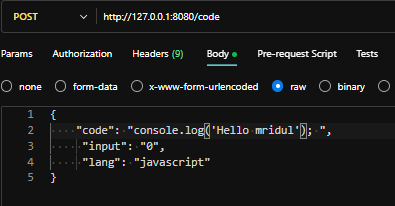
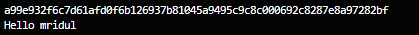

# Code Execution in Remote Containers


## Key Highlights:
1. Executes c, cpp, rust, python and javascript code
2. Asynchronously background processes using goroutines.
3. Realtime feedback to client using websocket layer.
4. Code execution in sandboxed environment.
5. Code sanitization and prevention of malicious code from executing.
6. Multi stage docker build of docker application.
7. Token based rate limiting.
8. CI/CD pipeline to automatically push the server and worker instance images to docker hub with :latest tag.
9. k8s scripts to deploy application to eks cluster manually using github actions dashboard.

## Workflow: 
-  You take code, input and language as input, and send HTTP request. 
-  It gets added to rabbitmq queue.
-  Worker will consume request from from queue and process it inside remote machine with docker pre-installed.
- We will ssh into remote machine and transfer our code and then spin up a new container
- Execute code inside container.
- Return the stderr, stdout to the user.
-  Stop and remove the container


## Rabbitmq Cloud  setup: 
1. Login to `https://www.cloudamqp.com/`
2. Create new Rabbitmq instance.
3. Get AMQP instance and add to `.env` file of `/server` directory


## Remote machine Setup:
> Given terraform script configures EC2 Ubuntu instance and docker pre-installed for IAM user.

1. Create IAM user with `EC2FullAccess` and `EC2InstanceConnect` (for SSH) permissions IAM dashboard in AWS console.
2. Install terraform
3. Install AWS CLI
4. Configure aws cli using IAM user access key and secret key: 

```bash
aws configure
```

5. Initialize terraform

```bash
terraform init
```

6. Setup terraform state locally.

```bash
terraform plan -out=FILE
```

7. Apply changes.

```bash
terraform apply
```

8. Destroy the infrastructure

```bash
terraform destroy
```

## Demo:

- Post Request:



- Output: 


